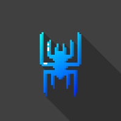

## Welcome to my Project site!

Here you can find all my Projects I worked on and released them. I really have fun developing games so there are quite a lot here. Some of them have multiplayersupport but only on one PC or Laptop or whatever. Nevertheless it makes fun to play with friends :) .

So lets don't talk too much... Lets have fun!

### Projects (quick download)
Sorted from new to old

- [More Dimensions](https://github.com/Asecave/More-Dimensions/archive/master.zip)
- [Mandelbrot-plotter](https://github.com/Asecave/Mandelbrot-plotter/archive/master.zip)
- [Password Lock](https://github.com/Asecave/password-Lock/archive/master.zip)
- [Nicht Nicht](https://github.com/Asecave/Nicht-Nicht/archive/master.zip)
- [Dot Engine](https://github.com/Asecave/Dot-engine/archive/master.zip)
- [Star Treck TNG Animation](https://github.com/Asecave/Animation-ST-TNG/archive/master.zip)
- [Better Snake](https://github.com/Asecave/Better-Snake/archive/master.zip)

## Projects info
Some important readme:

**Readme of Better Snake** (May, 2018)
```markdown
Things you should know about this game...
I coded this game in Java. But my Java skills are not perfect because 
I'm only half done with the Java-book I'm reading curently.
I made all the Graphics with 'Graphics2D' and don't (only when I code 
something with Graphics2D) work with classes yet. So it's a bit 
confusing when you read the code.
But the Programm is not really big, so you should find throw the code :). 

The graphics are simple, you have many things you can change in the options 
(all the Colors, speed, spawnrate of apples, ...) and it makes very much fun 
to play with friends. Seriously... I made this game for that!
If you want to change something: The sourcecode is somwhere in these 
folders here. So have fun!
(I'm german and only 15. So don't complain about my english skills :D)

Asecave
```

I think that really describes what I'm doing.

### Repositories
Just click [HERE](https://github.com/Asecave?tab=repositories) to go to my repositorys or click on a released project repository:
- [More Dimensions repository](https://github.com/Asecave/More-Dimensions)
- [Mandelbrot-plotter repository](https://github.com/Asecave/Mandelbrot-plotter)
- [Password Lock repository](https://github.com/Asecave/password-Lock)
- [Nicht Nicht repository](https://github.com/Asecave/Nicht-Nicht)
- [Dot Engine repository](https://github.com/Asecave/Dot-engine)
- [Star Treck TNG Animation repository](https://github.com/Asecave/Animation-ST-TNG)
- [Better Snake repository](https://github.com/Asecave/Better-Snake)

### Me



I also have a Youtube channel:
- [Asecave](https://www.youtube.com/channel/UCtkqkCLegB9ccwdDtQsZ36w)
